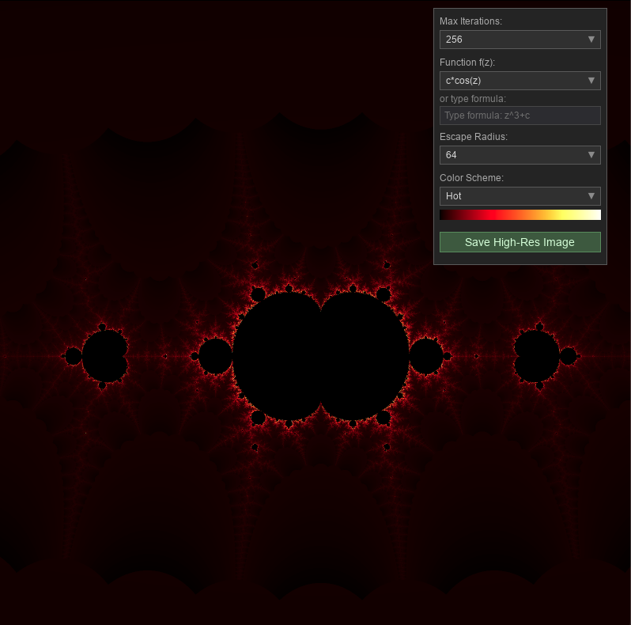
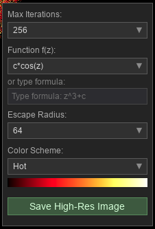

# MandelbrotVisualizer
This is a mini-project developed with the aid of Claude Opus 4.5 that models a high-performance, interactive fractal visualizer built with Python, featuring real-time exploration of the Mandelbrot set and 20+ variation functions.



## Features

- **Real-time exploration**: Smooth zooming and panning with mouse controls
- **20+ fractal functions**: Classic Mandelbrot (z² + c), Tricorn, Burning Ship variants, and transcendental functions
- **Multiple colormaps**: Hot, Ocean, Forest, Purple, Rainbow, Grayscale, and custom gradients
- **High-resolution export**: Save 4x resolution images to desktop
- **Async rendering**: UI stays responsive during computation
- **Smart caching**: Incremental rendering when panning, prefetching for smoother interaction

---

## Installation

### Prerequisites

- Python 3.8 or higher
- pip (Python package manager)

### Step 1: Clone the Repository

```bash
git clone https://github.com/yourusername/MandelbrotVisualizer.git
cd MandelbrotVisualizer
```

### Step 2: Create a Virtual Environment (Recommended)

```bash
python -m venv venv
source venv/bin/activate  # On macOS/Linux
# or
venv\Scripts\activate     # On Windows
```

### Step 3: Install Dependencies

```bash
pip install numpy numba pygame
```

| Package | Purpose |
|---------|---------|
| `numpy` | Array operations and numerical computation |
| `numba` | JIT compilation for high-performance computation |
| `pygame` | Window management, rendering, and user input |

### Step 4: Run the Visualizer

**From the parent directory** (recommended):
```bash
cd ..  # Go to parent of MandelbrotVisualizer folder
python -m MandelbrotVisualizer
```

**Or from inside the project folder**:
```bash
python __main__.py
```

> **Note**: The first run will take a few seconds while Numba compiles the JIT functions. Subsequent runs will be faster due to caching.

---

## Usage Guide

### Controls

| Action | Control |
|--------|---------|
| **Zoom in** | Scroll wheel up (zooms toward cursor position) |
| **Zoom out** | Scroll wheel down |
| **Pan** | Click and drag |
| **Reset view** | Press `R` |
| **Save high-res image** | Press `Cmd+S` (macOS) or `Ctrl+S` (Windows/Linux) |
| **Exit** | Press `Escape` or close window |

### Menu Options

The interactive menu in the top-right corner provides:

- **Max Iterations**: Controls detail level (higher = more detail but slower)
- **Color Scheme**: Choose from built-in colormaps or create custom gradients
- **Function**: Select from 20+ fractal iteration functions
- **Escape Radius**: Adjust the escape threshold for iteration
- **Custom Formula**: Enter your own mathematical formula



---

## Architecture Overview

### System Architecture Diagram

```
┌─────────────────────────────────────────────────────────────────────────────┐
│                              MandelbrotApp                                  │
│                         (Main Application Loop)                             │
│  ┌─────────────────────────────────────────────────────────────────────┐    │
│  │  • Event handling (zoom, pan, keyboard)                             │    │
│  │  • Render timing & coordination                                     │    │
│  │  • Display surface management                                       │    │
│  │  • History stack for zoom-out                                       │    │
│  └─────────────────────────────────────────────────────────────────────┘    │
│                                    │                                        │
│                    ┌───────────────┴───────────────┐                        │
│                    ▼                               ▼                        │
│  ┌─────────────────────────────┐   ┌─────────────────────────────┐          │
│  │     MandelbrotRenderer      │   │           Menu              │          │
│  │   (Async Rendering Engine)  │   │    (Interactive Settings)   │          │
│  │                             │   │                             │          │
│  │  • Background threads       │   │  • Dropdowns (iter, colors) │          │
│  │  • Iteration data cache     │   │  • Function selector        │          │
│  │  • Prefetch cache           │   │  • Custom gradient editor   │          │
│  │  • Incremental rendering    │   │  • Custom formula input     │          │
│  └──────────────┬──────────────┘   └─────────────────────────────┘          │
│                 │                                                           │
│                 ▼                                                           │
│  ┌─────────────────────────────────────────────────────────────────────┐    │
│  │                        Compute Module (Numba JIT)                   │    │
│  │  ┌──────────────────┐  ┌──────────────────┐  ┌──────────────────┐   │    │
│  │  │compute_mandelbrot│  │  apply_colormap  │  │   downscale_2x   │   │    │
│  │  │  (full/partial)  │  │     _smooth      │  │  (anti-aliasing) │   │    │
│  │  └──────────────────┘  └──────────────────┘  └──────────────────┘   │    │
│  │                                                                     │    │
│  │  • Parallel iteration using prange                                  │    │
│  │  • 20+ iterate_function variants                                    │    │
│  │  • Smooth coloring with fractional escape counts                    │    │
│  └─────────────────────────────────────────────────────────────────────┘    │
│                                                                             │
│  ┌─────────────────────────────────────────────────────────────────────┐    │
│  │                           Colormaps Module                          │    │
│  │                    4096-color gradient definitions                  │    │
│  └─────────────────────────────────────────────────────────────────────┘    │
└─────────────────────────────────────────────────────────────────────────────┘
```

### Data Flow

```
User Input (zoom/pan)
        │
        ▼
┌───────────────────┐
│  Calculate new    │
│  complex bounds   │
└─────────┬─────────┘
          │
          ▼
┌───────────────────┐     ┌─────────────────────┐
│  Check prefetch   │────▶│  Cache HIT: Use     │
│  cache            │     │  prefetched data    │
└─────────┬─────────┘     └─────────────────────┘
          │ Cache MISS
          ▼
┌───────────────────┐
│  Start async      │
│  render thread    │
└─────────┬─────────┘
          │
          ▼
┌───────────────────────────────────────────────┐
│              Compute Pipeline                 │
│  ┌─────────────┐   ┌─────────┐   ┌─────────┐  │
│  │ Mandelbrot  │──▶│ Apply   │──▶│Downscale│  │
│  │ Iteration   │   │Colormap │   │   2x    │  │
│  │ (parallel)  │   │ (smooth)│   │  (AA)   │  │
│  └─────────────┘   └─────────┘   └─────────┘  │
└───────────────────────────────────────────────┘
          │
          ▼
┌───────────────────┐
│  Update display   │
│  Start prefetch   │
└───────────────────┘
```

---

## Optimizations

The visualizer implements several optimizations for smooth, interactive performance:

### 1. Numba JIT Compilation

All performance-critical functions are compiled to native machine code using Numba:

```python
@jit(nopython=True, parallel=True, fastmath=True, cache=True)
def compute_mandelbrot(x_min, x_max, y_min, y_max, width, height, max_iter, ...):
    ...
```

- **`nopython=True`**: Forces full compilation (no Python fallback)
- **`parallel=True`**: Enables automatic parallelization with `prange`
- **`fastmath=True`**: Uses faster (slightly less precise) floating-point operations
- **`cache=True`**: Caches compiled functions to disk for fast startup

### 2. Parallel Computation

The main iteration loop uses `prange` for automatic multi-core parallelization:

```python
for py in prange(height):  # Rows computed in parallel across CPU cores
    for px in range(width):
        # Per-pixel iteration
```

### 3. Supersampled Anti-Aliasing (2x SSAA)

Rendering occurs at 2x resolution, then downscaled via box filter:

```
┌─────────────────┐      ┌─────────┐
│  2x Resolution  │      │ Display │
│   1600×1600     │─────▶│ 800×800 │
│   (computed)    │  2x  │ (smooth)│
└─────────────────┘      └─────────┘
```

This eliminates jagged edges without expensive multi-sample techniques.

### 4. Incremental Rendering (Cache Reuse)

When panning at the same zoom level, only newly visible regions are computed:

```
┌─────────┬───────────────────────┐
│ NEW     │                       │
│(compute)│                       │
├─────────┤    CACHED DATA        │
│         │   (reused from        │
│         │    previous frame)    │
│         │                       │
└─────────┴───────────────────────┘
```

The renderer detects overlapping regions and copies cached iteration data, computing only the exposed strips.

### 5. Predictive Prefetching

After each render completes, background threads precompute adjacent regions:

| Direction | Prefetched Region |
|-----------|-------------------|
| Left, Right, Up, Down | 50% pan in each direction |
| Zoom In | 0.85× scale centered |
| Zoom Out | 1.18× scale centered |

When the user pans or zooms in a predicted direction, the result is available instantly.

### 6. Smooth Coloring Algorithm

Instead of integer iteration counts (which cause color banding), the visualizer computes fractional escape values:

```python
# Smooth iteration count
log_zn = log(|z|²) / 2
nu = log(log_zn / log(escape_radius)) / log(degree)
smooth_iter = iteration + 1 - nu
```

<!--[IMAGE_PLACEHOLDER_{comparison showing color banding vs smooth coloring side by side}]
-->

### 7. Render Margin (Overscan)

Each frame renders 15% extra margin around the visible area:

```
┌─────────────────────────────┐
│  Margin (invisible buffer)  │
│  ┌───────────────────────┐  │
│  │                       │  │
│  │   Visible viewport    │  │
│  │       800×800         │  │
│  │                       │  │
│  └───────────────────────┘  │
└─────────────────────────────┘
        920×920 rendered
```

This allows small pans to complete instantly by extracting the new view from the margin.

### 8. Async Rendering with Threading

Computation runs in background threads, keeping the UI responsive:

```
Main Thread          Render Thread
    │                     │
    │ compute_async()     │
    ├────────────────────▶│
    │                     │ compute_mandelbrot()
    │ (UI responsive)     │ apply_colormap()
    │ handle_events()     │ downscale()
    │ draw_preview()      │
    │                     │
    │◀─────result_ready───┤
    │                     │
```

---

## Supported Fractal Functions

| ID | Function | Formula |
|----|----------|---------|
| 0 | Standard Mandelbrot | z² + c |
| 1 | Multibrot-3 | z³ + c |
| 2 | Multibrot-4 | z⁴ + c |
| 3 | Multibrot-5 | z⁵ + c |
| 4 | Tricorn (Mandelbar) | (z̄)² + c |
| 5 | Exponential | c·eᶻ |
| 6 | Sine | c·sin(z) |
| 7 | Variant | z² + z + c |
| 8-10 | Higher Multibrots | z⁶, z⁷, z⁸ + c |
| 11 | Variant | z² + c·z |
| 12-13 | Combined | z³ + z + c, z⁴ + z + c |
| 14 | Cosine | c·cos(z) |
| 15-19 | More variants | Various combinations |

<!--[IMAGE_PLACEHOLDER_{grid of 6 images showing different fractal functions like Tricorn, Burning Ship, and Sine}]
-->

---

## Custom Formulas

You can enter custom iteration formulas using the formula input in the menu. Supported syntax:

- Variables: `z` (current value), `c` (pixel coordinate)
- Operators: `+`, `-`, `*`, `/`, `**` (power)
- Functions: `sin`, `cos`, `exp`, `abs`, `conj` (conjugate)

Example: `z**3 + c*z` creates a cubic variant with linear term.

> **Note**: Custom formulas are interpreted at runtime and run slower than the built-in JIT-compiled functions.

---

## Project Structure

```
MandelbrotVisualizer/
├── __init__.py      # Package initialization
├── __main__.py      # Entry point (python -m MandelbrotVisualizer)
├── app.py           # Main application class and event loop
├── renderer.py      # Async rendering, caching, and prefetching
├── compute.py       # Numba JIT functions (iteration, colormap, downscale)
├── colormaps.py     # Color gradient definitions
├── menu.py          # Interactive settings UI
├── settings.json    # Persisted user preferences
└── README.md        # This file
```

---

## Troubleshooting

### "Compiling..." takes a long time on first run

This is normal. Numba compiles functions to native code on first use. Compiled results are cached in `__pycache__/` for subsequent runs.

### Low frame rate when zoomed in deeply

Increase `Max Iterations` gradually. Very high values (>2000) require more computation per pixel. Consider using a lower value while exploring, then increasing for final renders.

### Colors look banded

This shouldn't happen with the smooth coloring algorithm. If you see banding:
1. Ensure you're using a recent version
2. Try a different colormap
3. Increase max iterations

### ModuleNotFoundError: No module named '...'

This occurs when Numba's compiled cache references an old module name. Clear the cache:

```bash
rm -rf __pycache__/*.nbc __pycache__/*.nbi
```

Then run again—the functions will recompile with the correct module name.
